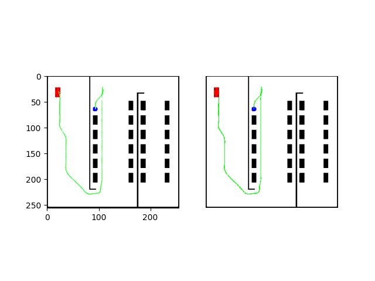

**Heads up:** Built in 2023 (In AI years, that's practically ancient) — read with appropriate historical skepticism.


# Parking Path Generator (Pix2Pix GAN vs deterministic planner)

Pixel-to-pixel GAN that predicts reverse-parking paths from occupancy images.  
Includes a deterministic A* + geometric planner used to generate training data.

---

## Problem

Reverse parking path planning on occupancy maps costs time using classical search and geometry.  

- Generate synthetic reverse-parking data with a deterministic planner.
- Train a Pix2Pix GAN to predict parking paths directly from environment images.
- Compare deterministic vs learned path planning in terms of inference speed.

Average inference times:

- Deterministic planner: about 1.95 seconds.
- GAN-based predictor: about 0.39 seconds.

---

## Repository layout

- `train2.py`  
	Pix2Pix GAN definition and training loop.

- `predict2.py`  
	Loads a trained generator model and predicts parking paths on test images.

- `data.html`  
	HTML redirect to a Google Drive folder containing data/models.

Parking scenario generator:

- `generate_dataset/`
	- `generate_dataset/generate_imgs.py`  
		Generates synthetic parking scenarios and saves paired input/output images.
	- `generate_dataset/environment.py`  
		Rendering of the parking lot, car geometry, obstacles, and goal visualization.  
	- `generate_dataset/pathplanning.py`  
		A* grid planner and parking path generator.  
	- `generate_dataset/control.py`  
		Simple kinematic car model and Linear MPC controllers.   
	- `generate_dataset/input_images/`, `generate_dataset/output_images/`  
		Locations for image pairs

Datasets for training and testing:

- `images/`
	- `images/train/`
		- `images/train/input_images2/`  
			Training inputs: environment/occupancy images.
		- `images/train/output_images2/`  
			Training targets: rendered paths.
	- `images/testing/`
		- `images/testing/input_images/`  
			Test inputs used by `predict2.py`.
		- `images/testing/output_images_truth/`  
			Ground-truth outputs for comparison.
		- `images/testing/results_processed/`  
			Prediction visualizations saved by `predict2.py`.

---

## Prerequisites

- Python 3
- Core libraries:
	- `numpy`
	- `matplotlib`
	- `Pillow` (`PIL`)
	- `opencv-python` (`cv2`)
	- `scipy`
	- `tensorflow`
	- `keras`
	- `time`
	- `os`

GPU support is optional but helps with training speed.

---

## Installation

Create a virtual environment and install the dependencies that the scripts import:

```bash
# from repository root
python -m venv .venv
source .venv/bin/activate        # on Windows: .venv\Scripts\activate

pip install numpy matplotlib pillow opencv-python scipy
pip install tensorflow keras     # choose CPU/GPU build of TensorFlow as needed
```

If you intend to use the MPC components in `generate_dataset/control.py`, also install:

```bash
pip install scipy
```

(Already included above, called out here because MPC uses `scipy.optimize.minimize`.)

---

## Data

Two options:

### 1. Use the provided data

`data.html` redirects to a Google Drive folder:

```html
<meta http-equiv="refresh" content="0; url=https://drive.google.com/drive/folders/1IBuwOwnWUQRp8ELAZeonhuRYpG_XCuJc?usp=drive_link" />
```

Download the data/models from there and place them following the structure used in the code:

- Training:
	- `images/train/input_images2/*.png`
	- `images/train/output_images2/*.png`
- Testing:
	- `images/testing/input_images/*.png`
	- `images/testing/output_images_truth/*.png`
- Trained model for inference:
	- `models/model_f_aug9_8.h5` (or adjust the path in `predict2.py`).

### 2. Generate synthetic parking scenarios

Deterministic generator lives in `generate_dataset/generate_imgs.py`.  
Run it from inside the `generate_dataset/` directory so imports work:

```bash
cd generate_dataset

# generate 349 scenarios with default arguments
python generate_imgs.py

# optional: tweak scenario parameters
python generate_imgs.py \
	--x_start 0 \
	--y_start 90 \
	--psi_start 0 \
	--x_end 90 \
	--y_end 80 \
	--parking 1
```

The script:

- Builds a parking lot layout
- Places random obstacle squares
- Plans a route with:
	- Global path
	- Parking maneuver
	- Spline interpolation
- Renders:
	- Input environment image (obstacles + goal) to `generate_dataset/input_images/environment{iter}.png`
	- Output image with full path to `generate_dataset/output_images/environment{iter}.png`

- Inputs → `images/train/input_images2/`
- Outputs → `images/train/output_images2/`

---

## Training the Pix2Pix GAN

Training script: `train2.py`.

Key components:

- Discriminator: `define_discriminator`  
	PatchGAN over concatenated input/target pairs.
- Generator: `define_generator`  
	U-Net encoder–decoder with skip connections and transposed convolutions.
- Combined model: `define_gan`  
	Uses binary cross-entropy for the discriminator output and MAE for L1 image loss.

Data loading:

- `load_images` reads all files from a directory, resizes to (256,256), and normalizes to [-1, 1].
- `load_real_samples` expects:
	- `input_images2/`
	- `output_images2/`
	as directories relative to the current working directory.

To match the existing folder layout, run training from `images/train/`:

```bash
cd images/train

# run trainer from repo root using a relative path
python ../../train2.py
```

What happens during training:

- Samples mini-batches from the paired dataset with:
	- `generate_real_samples`
	- `generate_fake_samples`
- Trains:
	- Discriminator on real and fake pairs.
	- GAN to both fool the discriminator and minimize L1 to the target.
- Periodically:
	- Saves comparison plots and models via `summarize_performance`:  
		`plot_000010.png`, `model_000010.h5`, etc.

Models and plots save into the current directory (`images/train/` when run as above).

---

## Running inference

Inference script: `predict2.py`.

It:

1. Loads a generator model:
	 ```python
	 model = load_model('models/model_f_aug9_8.h5')
	 ```
	 Adjust this path if your trained model lives elsewhere (e.g., one of the `model_*.h5` files saved by training).

2. Loads test inputs from:
	 - `images/testing/input_images/environment{im}.png`

3. Predicts an output for each input.

4. Blends the prediction with the source image using `append_images`, keeping non-white pixels from the generated image.

5. Visualizes and saves:
	 - Left: generated path overlaid on the input.
	 - Right: ground truth from  
		 `images/testing/output_images_truth/environment{im}.png`
	 - Output files:  
		 `images/testing/results_processed/environment{im}.png`

Run from the repository root so paths resolve correctly:

```bash
# from repo root
python predict2.py
```


---

## Example output



Left portion is generated by the neural network model and right portion is from the deterministic planner.

---

## Key features

- Evaluation pipeline:
	- Batch prediction over a test set.  
		`predict2.py`
	- Overlay of predicted paths onto original environment images through simple alpha compositing.  
		`append_images`

---
